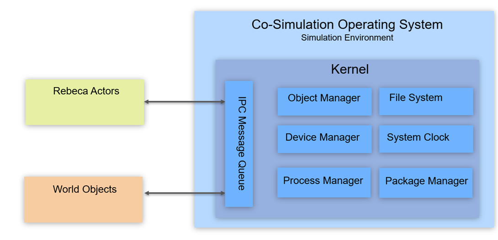

# Interop sample: Integrating Rebeca actors with a simulation environment (Port)

This sample demonstrates **interop** between:
- **Rebeca actors** (your model logic), and
- an external **simulation environment** (world/physics/devices),

using a built-in **`port` object** as a bridge.

At a high level, the Rebeca model sends commands (e.g., `"move"`) to the host, and the host can optionally provide data back (e.g., sensor readings, acknowledgements, world state updates).

---

## Concept: Rebeca + Simulation via an IPC-backed “Co-Simulation OS”

If you treat your simulation environment like an “operating system” for a co-simulation, the Rebeca runtime becomes a client of that OS.

> **Diagram (conceptual architecture)**  
> Add the image to your repo (e.g., `samples/interop/Concept.png`) and reference it like this:



### How to read the diagram

- **Rebeca Actors** (left, green): your Rebeca reactive classes (“rebecs”) that produce decisions and react to events.
- **World Objects** (left, orange): external simulation entities (cars, roads, sensors, traffic lights, etc.).
- **IPC Message Queue** (middle): the bridge between Rebeca and the simulation environment.
- **Kernel (Simulation Environment)** (right, blue): provides services and manages the simulation:
  - **Object Manager**: registration/lookup of world objects
  - **Device Manager**: simulated devices/sensors/actuators
  - **System Clock**: the simulation time base
  - **Process Manager**: scheduling/coordinating co-sim components
  - **File System / Package Manager**: configuration, scenario loading, plugins, etc.

In this sample, the `port` object represents the “IPC message queue” interface from the actor’s perspective.

---

## What’s inside this sample

Directory (as shipped in the sample zip):

- `port.rebeca` — Rebeca model that opens a port and sends a command
- `port.py` — Python host that runs the Rebeca virtual machine and implements a Port interface
- `README.md` — short description (this document is the expanded version)

---

## How the sample works (step-by-step)

### 1) Host side (Python): provide a Port interface to the VM

In `port.py`, the host defines a class that implements the Port `Interface`:

- `open(type_or_address) -> fd`  
- `send(fd, msg, options=None)`  
- `receive(fd, options=None) -> msg`  
- `close(fd)`  
- plus helpers like `connect`, `setopt`, `getopt`, `is_open`, etc.

In the sample implementation, these methods just **print to the console** so you can see when the Rebeca model calls them.

The VM is created with a mapping that injects the interface:

```python
vm = VirtualMachine({
    "port": PortExampleInterface()
})
```
This tells the runtime: when the Rebeca program uses the built-in port object, delegate the actual I/O to this host-provided interface.


### 2) Model side (Rebeca): open a port and send a command

In `port.rebeca`, the actor keeps a port in its state. What happens at runtime:

1. The Car constructor calls topic.open(...).
2. The port object asks the host interface to open(...)
3. The host returns a file descriptor (fd), stored internally by the port
4. The actor schedules sendMsg()
5. In sendMsg(), the actor calls topic.send("move")
6. The port object calls the host interface’s send(fd, "move")
7. When the actor instance is destroyed, topic.close() closes the port on the host side.

